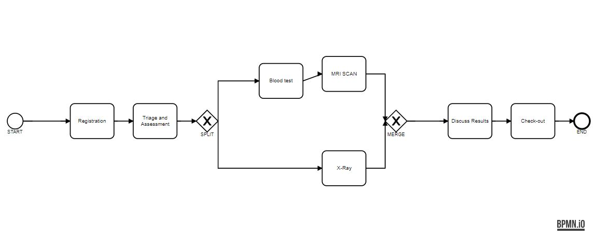
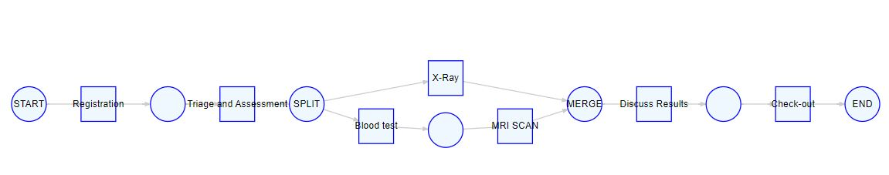

<!-- README.md is generated from README.Rmd. Please edit that file -->

```{r, include = FALSE}
knitr::opts_chunk$set(
  collapse = TRUE,
  comment = "#>",
  fig.path = "man/figures/README-",
  out.width = "100%"
)
```

# bupaRminer

<!-- badges: start -->
<!-- badges: end -->

bupaRminer is a novel process discovery tool that is designed to discover sound BPMN models from event logs. The resulting BPMN diagram is based on a declarative model that is expressed as statistical likelihoods of pairwise relationships between activities. The likelihood metrics are standardized to enable a fair comparison. One of the advantages of bupaRminer is that it does not require fine-tuning of hyperparameters, making it easy to use for those who are not familiar with process discovery or process mining. Additionally, its statistical foundations ensure that it handles noise in the event log naturally. Contrary to most other techniques, bupaRminer considers both start and complete timestamps of activities.

## Installation

You can install the development version of bupaRminer from [GitHub](https://github.com/) with:

``` r
# install.packages("devtools")
devtools::install_github("bupaverse/bupaRminer")
```

## Example

```{r warning = F, message = F, eval = F}
library(bupaRminer)
library(bupaverse)
library(bpmnR)

patients %>%
  discover() -> bpmn

render_bpmn(bpmn)

```

```{r echo = F}

```

After converting the resulting BPMN model to a petrinet, it can be used to measure conformance. 

```{r warning =F , message = F, eval = F}
library(pm4py) 
library(petrinetR) 
patients %>%
  discover() %>%
  to_petrinet() -> petrinet

render_PN(petrinet)


fitness_alignments(patients, petrinet)
precision_alignments(patients, petrinet)

```


```{r echo = F}

```


```
aligning log, completed variants ::   0%|          | 0/7 [00:00<?, ?it/s]$percFitTraces
aligning log, completed variants :: 100%|██████████| 7/7 [00:00<00:00, 101.21it/s]
[1] 98.4

$averageFitness
[1] 0.9959135

$percentage_of_fitting_traces
[1] 98.4

$average_trace_fitness
[1] 0.9959135

$log_fitness
[1] 0.9969355

computing precision with alignments, completed variants :: 100%|██████████| 7/7 [00:00<00:00, 768.15it/s]
[1] 1

```


